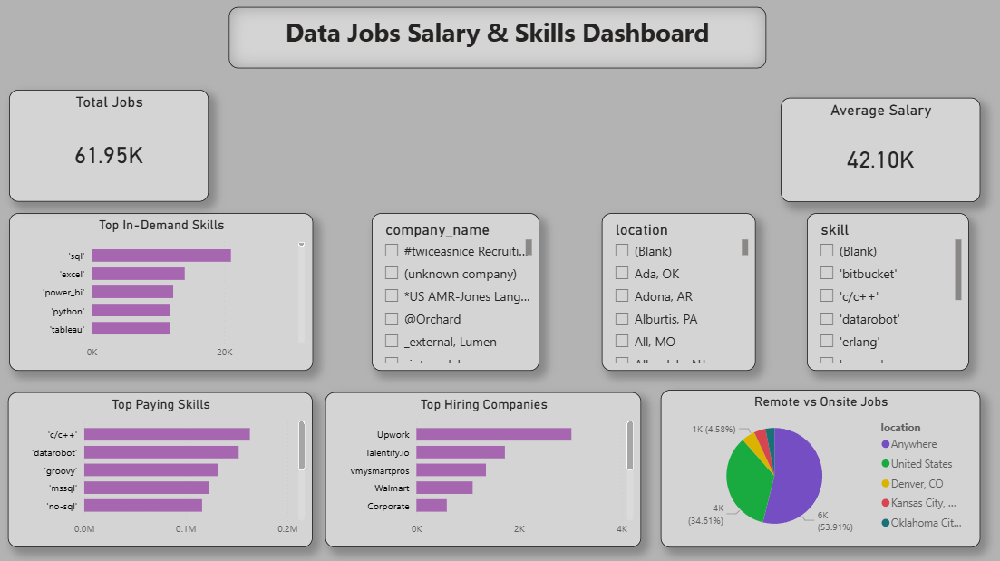

# Data Jobs Salary & Skills Dashboard

## Project Overview
This project analyzes job salaries, hiring trends, and in-demand skills in the data analytics industry using SQL, Python, and Power BI.

## Tools & Technologies
- PostgreSQL
- SQL
- Python
- Pandas
- Jupyter Notebook
- Power BI

## Key Insights
- SQL is the most in-demand skill.
- Python and Power BI are highly valuable in analytics roles.
- Remote jobs dominate the data analytics market.
- Certain technical skills offer significantly higher salaries.

## Dashboard Features
- Top In-Demand Skills
- Top Paying Skills
- Top Hiring Companies
- Remote vs Onsite Jobs
- Interactive Slicers
- KPI Cards

## Files Included
- `project_queries.sql`
- `eda_analysis.ipynb`
- `dashboard.png`

## Dashboard Preview

## Author
Chetan Patil
